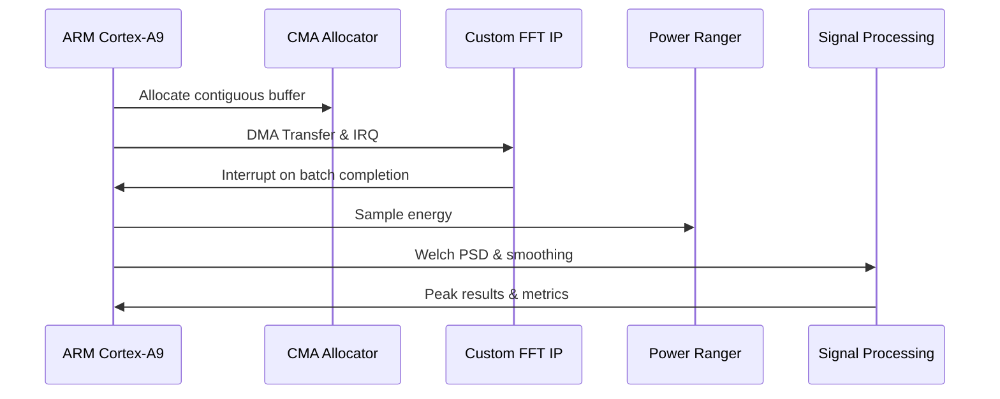

# VEGA Radio-Astronomy Accelerator

An **FPGA-accelerated digital signal processing (DSP)** pipeline converting raw radio telescope data from EPFL’s Very Elegant Galactic Antenna (VEGA) into calibrated spectra. The pipeline extracts Doppler-shifted 21 cm hydrogen line peaks to measure the rotation speed of the Milky Way. Designed for the Xilinx Zynq-7020 on a PYNQ-Z2 board, this project exemplifies hardware/software co-design with latency/energy Pareto-optimal tradeoffs across 10 FFT configurations.

---


---
## Project Motivation & Scientific Context

Hydrogen is the most abundant element in our galaxy, emitting a characteristic 21 cm wavelength due to spin-flip transitions. By detecting Doppler-shifted peaks of these emissions, we measure the rotational velocities of different galactic arms. This project aims to perform efficient real-time processing on large radio data sets captured by the VEGA telescope at EPFL, minimizing both latency and energy consumption.

---

## Detailed DSP Pipeline

The signal processing pipeline ncludes:

1. Loading of raw input data and calibration gains.
2. Segmentation according to selected FFT resolution (1k–524k points).
3. Hanning windowing with 75% overlap.
4. FFT execution (performed 40,000 times per dataset).
5. Averaging power spectrum calculation (Welch’s method).
6. Spectrum normalization.
7. Moving average, spike smoothing, and Gaussian smoothing.
8. Calibration with antenna gains.
9. Peak detection corresponding to galactic arms.
10. Calculation of relative velocities based on Doppler shift.

---

## Pareto Optimization Strategy

The design strategically balances the following metrics:

* **Latency:** Total execution time.
* **Energy Consumption:** Efficiency measured directly on the board.
* **Hardware Resources:** DSP, LUT, BRAM, FF usage on FPGA.
* **Resolution:** Frequency accuracy.
* **Flexibility:** Support for multiple FFT configurations.
* **SNR:** Signal quality maintained above 70 dB.

## Table of solutions (PYNQ-Z2)
| solution   |   config |    time |   resources |   energy |   resolution |     snr |   tts |   cpu |   brams |   dsps |   luts |    ffs |   brams_per |   dsps_per |   luts_per |   ffs_per |   flexibility |    edp | color   | pareto   |   plevel |
|:-----------|---------:|--------:|------------:|---------:|-------------:|--------:|------:|------:|--------:|-------:|-------:|-------:|------------:|-----------:|-----------:|----------:|--------------:|-------:|:--------|:---------|---------:|
| EE0        |        9 | 714.307 |       10    | 1039.42  |         3.91 | 126.3   |     0 |    50 |       0 |      0 |      0 |      0 |        0    |       0    |       0    |      0    |            10 | 742464 | green   | True     |        1 |
| EE0        |        7 | 121.015 |       10    |  190.884 |        15.62 | 123     |     0 |    50 |       0 |      0 |      0 |      0 |        0    |       0    |       0    |      0    |            10 |  23099 | green   | True     |        1 |
| EE0        |        1 |  23.2   |       10    |   33.798 |      1000    | 130.8   |     0 |    50 |       0 |      0 |      0 |      0 |        0    |       0    |       0    |      0    |            10 |    784 | green   | True     |        2 |
| EE0        |        0 |  19.288 |       10    |   27.703 |      2000    | 128.4   |     0 |    50 |       0 |      0 |      0 |      0 |        0    |       0    |       0    |      0    |            10 |    534 | green   | True     |        2 |
| EE0        |        6 |  68.202 |       10    |  112.439 |        31.25 | 136.4   |     0 |    50 |       0 |      0 |      0 |      0 |        0    |       0    |       0    |      0    |            10 |   7668 | green   | True     |        2 |
| EE0        |        2 |  28.815 |       10    |   43.606 |       500    | 131.6   |     0 |    50 |       0 |      0 |      0 |      0 |        0    |       0    |       0    |      0    |            10 |   1256 | green   | True     |        2 |
| EE0        |        3 |  32.703 |       10    |   50.376 |       250    | 134.2   |     0 |    50 |       0 |      0 |      0 |      0 |        0    |       0    |       0    |      0    |            10 |   1647 | green   | True     |        2 |
| EE0        |        8 | 222.204 |       10    |  336.362 |         7.81 | 119.7   |     0 |    50 |       0 |      0 |      0 |      0 |        0    |       0    |       0    |      0    |            10 |  74740 | green   | True     |        1 |
| EE0        |        5 |  43.174 |       10    |   68.503 |        62.5  | 126.9   |     0 |    50 |       0 |      0 |      0 |      0 |        0    |       0    |       0    |      0    |            10 |   2957 | green   | True     |        1 |
| EE0        |        4 |  35.397 |       10    |   54.799 |       125    | 127     |     0 |    50 |       0 |      0 |      0 |      0 |        0    |       0    |       0    |      0    |            10 |   1939 | green   | True     |        1 |
| EE1675     |        0 |  24.825 |       19.9  |   36.644 |      2000    | 120.8   |    16 |    50 |      38 |     14 |   5067 |   6886 |       27.14 |       6.36 |       9.52 |      6.47 |             1 |    909 | red     | False    |        0 |
| EE4877     |        5 |  59.336 |      100    |   90.153 |        62.5  | 110.6   |    28 |   100 |     140 |    220 |  53200 | 106400 |      100    |     100    |     100    |    100    |            10 |   5349 | red     | False    |        0 |
| EE4877     |        4 |  59.142 |      100    |   89.503 |       125    | 113.5   |    28 |   100 |     140 |    220 |  53200 | 106400 |      100    |     100    |     100    |    100    |            10 |   5293 | red     | False    |        0 |
| EE4877     |        1 |  63.262 |      100    |   94.066 |      1000    | 128.3   |    28 |   100 |     140 |    220 |  53200 | 106400 |      100    |     100    |     100    |    100    |            10 |   5950 | red     | False    |        0 |
| EE6860     |        4 |  26.128 |       30.25 |   41.962 |       125    | 117.186 |    28 |    50 |     108 |     14 |   6043 |   6806 |       77.14 |       6.36 |      11.36 |      6.4  |             1 |   1096 | green   | True     |        1 |
| EE4877     |        3 |  60.12  |      100    |   90.929 |       250    | 119.5   |    28 |   100 |     140 |    220 |  53200 | 106400 |      100    |     100    |     100    |    100    |            10 |   5466 | red     | False    |        0 |
| EE4877     |        6 |  66.782 |      100    |  102.583 |        31.25 | 108.3   |    28 |   100 |     140 |    220 |  53200 | 106400 |      100    |     100    |     100    |    100    |            10 |   6850 | green   | True     |        1 |
| EE5256     |        2 |  23.739 |       18.4  |   35.347 |       500    | 126.2   |    28 |    50 |      28 |     14 |   4938 |   6758 |       20    |       6.36 |       9.28 |      6.35 |             1 |    839 | green   | True     |        1 |
| EE8511     |        2 |  25.017 |       40.81 |   41.046 |       500    | 113.3   |    28 |    50 |      66 |    128 |  17766 |  15936 |       47.5  |      58.18 |      33.39 |     14.98 |             7 |   1026 | red     | False    |        0 |
| EE4877     |        7 | 115.052 |      100    |  175.391 |        15.62 |  96.5   |    28 |   100 |     140 |    220 |  53200 | 106400 |      100    |     100    |     100    |    100    |            10 |  20179 | green   | True     |        1 |
| EE8511     |        4 |  25.085 |       40.81 |   42.323 |       125    | 113.5   |    28 |    50 |      66 |    128 |  17766 |  15936 |       47.5  |      58.18 |      33.39 |     14.98 |             7 |   1061 | green   | True     |        1 |
| EE4877     |        2 |  61.572 |      100    |   92.542 |       500    | 113.3   |    28 |   100 |     140 |    220 |  53200 | 106400 |      100    |     100    |     100    |    100    |            10 |   5697 | red     | False    |        0 |
| EE8511     |        3 |  24.361 |       40.81 |   40.652 |       250    | 119.5   |    28 |    50 |      66 |    128 |  17766 |  15936 |       47.5  |      58.18 |      33.39 |     14.98 |             7 |    990 | green   | True     |        1 |
| EE8511     |        6 |  34.448 |       40.81 |   58.811 |        31.25 | 108.3   |    28 |    50 |      66 |    128 |  17766 |  15936 |       47.5  |      58.18 |      33.39 |     14.98 |             7 |   2025 | green   | True     |        1 |
| EE4877     |        0 |  70.289 |      100    |  103.91  |      2000    | 135     |    28 |   100 |     140 |    220 |  53200 | 106400 |      100    |     100    |     100    |    100    |            10 |   7303 | green   | True     |        1 |
| EE8511     |        1 |  27.243 |       40.81 |   43.659 |      1000    | 128.3   |    28 |    50 |      66 |    128 |  17766 |  15936 |       47.5  |      58.18 |      33.39 |     14.98 |             7 |   1189 | red     | False    |        0 |
| EE8511     |        5 |  26.157 |       40.81 |   44.497 |        62.5  | 110.6   |    28 |    50 |      66 |    128 |  17766 |  15936 |       47.5  |      58.18 |      33.39 |     14.98 |             7 |   1163 | green   | True     |        1 |
| EE4877     |        9 | 697.102 |      100    | 1026.07  |         3.91 |  97.9   |    28 |   100 |     140 |    220 |  53200 | 106400 |      100    |     100    |     100    |    100    |            10 | 715272 | green   | True     |        1 |
| EE4877     |        8 | 210.751 |      100    |  315.718 |         7.81 |  94.1   |    28 |   100 |     140 |    220 |  53200 | 106400 |      100    |     100    |     100    |    100    |            10 |  66537 | green   | True     |        1 |
| EE8511     |        0 |  33.645 |       40.81 |   53.611 |      2000    | 135     |    28 |    50 |      66 |    128 |  17766 |  15936 |       47.5  |      58.18 |      33.39 |     14.98 |             7 |   1803 | green   | True     |        1 |
| EE6791     |        2 |  15.585 |       16.06 |   22.534 |       500    |  95.449 |    29 |    50 |      20 |      8 |   3856 |   5467 |       14.29 |       3.64 |       7.25 |      5.14 |             1 |    351 | green   | True     |        2 |
| EE6751     |        0 |  16.107 |       14.11 |   22.958 |      2000    |  94.8   |    29 |    50 |       6 |      8 |   3821 |   5442 |        4.64 |       3.64 |       7.18 |      5.11 |             1 |    369 | green   | True     |        1 |
| EE1674     |        4 |   9.001 |       20    |   15.181 |       125    | 110.2   |    30 |   100 |       0 |      0 |      0 |      0 |        0    |       0    |       0    |      0    |            10 |    136 | green   | True     |        1 |
| EE9651     |        7 | 115.098 |       20    |  183.676 |        15.62 | 107.8   |    30 |   100 |       0 |      0 |      0 |      0 |        0    |       0    |       0    |      0    |            10 |  21140 | green   | True     |        1 |
| EE1360     |        9 | 653.945 |       20    |  942.208 |         3.91 |  92.9   |    30 |   100 |       0 |      0 |      0 |      0 |        0    |       0    |       0    |      0    |            10 | 616152 | red     | False    |        0 |
| EE1674     |        3 |   8.353 |       20    |   13.926 |       250    | 117.9   |    30 |   100 |       0 |      0 |      0 |      0 |        0    |       0    |       0    |      0    |            10 |    116 | green   | True     |        1 |
| EE1360     |        4 |  12.742 |       20    |   19.733 |       125    | 110.2   |    30 |   100 |       0 |      0 |      0 |      0 |        0    |       0    |       0    |      0    |            10 |    251 | red     | False    |        0 |
| EE1360     |        3 |  10.897 |       20    |   16.594 |       250    | 117.9   |    30 |   100 |       0 |      0 |      0 |      0 |        0    |       0    |       0    |      0    |            10 |    180 | red     | False    |        0 |
| EE9651     |        8 | 214.939 |       20    |  328.042 |         7.81 | 115.5   |    30 |   100 |       0 |      0 |      0 |      0 |        0    |       0    |       0    |      0    |            10 |  70509 | green   | True     |        1 |
| EE1360     |        0 |   7.49  |       20    |   10.753 |      2000    | 131.5   |    30 |   100 |       0 |      0 |      0 |      0 |        0    |       0    |       0    |      0    |            10 |     80 | red     | False    |        0 |
| EE9651     |        3 |  26.019 |       20    |   41.002 |       250    | 132.7   |    30 |   100 |       0 |      0 |      0 |      0 |        0    |       0    |       0    |      0    |            10 |   1066 | green   | True     |        1 |
| EE1674     |        0 |   7.221 |       20    |   11.25  |      2000    | 131.5   |    30 |   100 |       0 |      0 |      0 |      0 |        0    |       0    |       0    |      0    |            10 |     81 | red     | False    |        0 |
| EE9651     |        4 |  28.626 |       20    |   45.778 |       125    | 133.7   |    30 |   100 |       0 |      0 |      0 |      0 |        0    |       0    |       0    |      0    |            10 |   1310 | green   | True     |        1 |
| EE1674     |        6 |  12.178 |       20    |   20.871 |        31.25 | 114.1   |    30 |   100 |       0 |      0 |      0 |      0 |        0    |       0    |       0    |      0    |            10 |    254 | green   | True     |        1 |
| EE9651     |        9 | 708.085 |       20    | 1038.22  |         3.91 | 127.5   |    30 |   100 |       0 |      0 |      0 |      0 |        0    |       0    |       0    |      0    |            10 | 735146 | green   | True     |        1 |
| EE1360     |        6 |  22.002 |       20    |   34.021 |        31.25 | 114.1   |    30 |   100 |       0 |      0 |      0 |      0 |        0    |       0    |       0    |      0    |            10 |    748 | red     | False    |        0 |
| EE1360     |        8 | 165.065 |       20    |  241.537 |         7.81 |  95.4   |    30 |   100 |       0 |      0 |      0 |      0 |        0    |       0    |       0    |      0    |            10 |  39869 | red     | False    |        0 |
| EE1674     |        9 |  99.149 |       20    |  154.257 |         3.91 |  92.9   |    30 |   100 |       0 |      0 |      0 |      0 |        0    |       0    |       0    |      0    |            10 |  15294 | green   | True     |        1 |
| EE8468     |        0 |  33.453 |      100    |   47.942 |      2000    | 129.1   |    30 |   100 |     140 |    220 |  53200 | 106400 |      100    |     100    |     100    |    100    |             1 |   1603 | red     | False    |        0 |
| EE1360     |        7 |  68.371 |       20    |  102.262 |        15.62 |  96.8   |    30 |   100 |       0 |      0 |      0 |      0 |        0    |       0    |       0    |      0    |            10 |   6991 | red     | False    |        0 |
| EE1674     |        1 |   6.594 |       20    |   10.393 |      1000    | 133.5   |    30 |   100 |       0 |      0 |      0 |      0 |        0    |       0    |       0    |      0    |            10 |     68 | green   | True     |        2 |
| EE1360     |        1 |   8.034 |       20    |   11.642 |      1000    | 133.5   |    30 |   100 |       0 |      0 |      0 |      0 |        0    |       0    |       0    |      0    |            10 |     93 | red     | False    |        0 |
| EE1674     |        7 |  19.591 |       20    |   33.505 |        15.62 |  96.8   |    30 |   100 |       0 |      0 |      0 |      0 |        0    |       0    |       0    |      0    |            10 |    656 | green   | True     |        1 |
| EE1360     |        5 |  14.937 |       20    |   23.315 |        62.5  | 110     |    30 |   100 |       0 |      0 |      0 |      0 |        0    |       0    |       0    |      0    |            10 |    348 | red     | False    |        0 |
| EE9651     |        2 |  22.97  |       20    |   35.232 |       500    | 129.7   |    30 |   100 |       0 |      0 |      0 |      0 |        0    |       0    |       0    |      0    |            10 |    809 | green   | True     |        1 |
| EE9651     |        1 |  18.116 |       20    |   26.627 |      1000    | 132.5   |    30 |   100 |       0 |      0 |      0 |      0 |        0    |       0    |       0    |      0    |            10 |    482 | red     | False    |        0 |
| EE9651     |        5 |  36.519 |       20    |   59.458 |        62.5  | 122.1   |    30 |   100 |       0 |      0 |      0 |      0 |        0    |       0    |       0    |      0    |            10 |   2171 | green   | True     |        1 |
| EE1674     |        8 |  34.029 |       20    |   56.15  |         7.81 |  95.4   |    30 |   100 |       0 |      0 |      0 |      0 |        0    |       0    |       0    |      0    |            10 |   1910 | green   | True     |        1 |
| EE1674     |        2 |   7.125 |       20    |   11.514 |       500    | 114.7   |    30 |   100 |       0 |      0 |      0 |      0 |        0    |       0    |       0    |      0    |            10 |     82 | green   | True     |        1 |
| EE9651     |        0 |  15.226 |       20    |   22.019 |      2000    | 124.4   |    30 |   100 |       0 |      0 |      0 |      0 |        0    |       0    |       0    |      0    |            10 |    335 | red     | False    |        0 |
| EE1360     |        2 |   8.83  |       20    |   12.921 |       500    | 114.7   |    30 |   100 |       0 |      0 |      0 |      0 |        0    |       0    |       0    |      0    |            10 |    114 | red     | False    |        0 |
| EE9651     |        6 |  63.093 |       20    |  106.291 |        31.25 | 120.5   |    30 |   100 |       0 |      0 |      0 |      0 |        0    |       0    |       0    |      0    |            10 |   6706 | green   | True     |        1 |
| EE1674     |        5 |  10.115 |       20    |   17.048 |        62.5  | 110     |    30 |   100 |       0 |      0 |      0 |      0 |        0    |       0    |       0    |      0    |            10 |    172 | green   | True     |        1 |
| EE9920     |        0 |   5.256 |       44.46 |    8.643 |      2000    | 129.4   |    31 |   100 |      68 |    140 |   3004 |   4734 |       48.57 |      63.64 |       5.65 |      4.45 |             1 |     45 | green   | True     |        2 |
| EE2247     |        0 |   7.72  |       44.46 |   12.632 |      2000    | 128.8   |    31 |   100 |      68 |    140 |   3004 |   4734 |       48.57 |      63.64 |       5.65 |      4.45 |             1 |     97 | red     | False    |        0 |
| EE6590     |        0 |   6.73  |       44.46 |   10.89  |      2000    | 128.8   |    31 |   100 |      68 |    140 |   3004 |   4734 |       48.57 |      63.64 |       5.65 |      4.45 |             1 |     73 | red     | False    |        0 |
| EE6517     |        0 |   6.053 |       44.46 |   10.021 |      2000    | 119.9   |    31 |   100 |      68 |    140 |   3004 |   4734 |       48.57 |      63.64 |       5.65 |      4.45 |             1 |     60 | red     | False    |        0 |
| EE3312     |        0 |  50.016 |      100    |   78.5   |      2000    | 120.1   |    32 |   100 |     140 |    220 |  53200 | 106400 |      100    |     100    |     100    |    100    |             1 |   3926 | red     | False    |        0 |
| EE1687     |        5 |  80.484 |       18.81 |  124.746 |        62.5  | 124.1   |    33 |    50 |       2 |     35 |   9553 |   9308 |        1.43 |      15.91 |      17.96 |      8.75 |            10 |  10040 | red     | False    |        0 |
| EE8686     |        6 |  26.385 |       39.76 |   45.408 |        31.25 | 108.3   |    33 |    50 |      67 |    128 |  15397 |  14691 |       47.86 |      58.18 |      28.94 |     13.81 |             7 |   1198 | red     | False    |        0 |
| EE1687     |        9 | 684.868 |       18.81 | 1023.86  |         3.91 | 114.8   |    33 |    50 |       2 |     35 |   9553 |   9308 |        1.43 |      15.91 |      17.96 |      8.75 |            10 | 701206 | green   | True     |        1 |
| EE1687     |        8 | 226.982 |       18.81 |  342.214 |         7.81 | 121.5   |    33 |    50 |       2 |     35 |   9553 |   9308 |        1.43 |      15.91 |      17.96 |      8.75 |            10 |  77676 | green   | True     |        1 |
| EE1687     |        7 | 133.877 |       18.81 |  204.305 |        15.62 | 118.6   |    33 |    50 |       2 |     35 |   9553 |   9308 |        1.43 |      15.91 |      17.96 |      8.75 |            10 |  27351 | red     | False    |        0 |
| EE1687     |        6 |  88.268 |       18.81 |  136.407 |        31.25 | 125.7   |    33 |    50 |       2 |     35 |   9553 |   9308 |        1.43 |      15.91 |      17.96 |      8.75 |            10 |  12040 | red     | False    |        0 |
| EE3285     |        0 |   2.205 |       57.94 |    3.847 |      2000    | 119.2   |    33 |   100 |      77 |    166 |  19060 |  24898 |       55    |      75.45 |      35.83 |     23.4  |             1 |      8 | green   | True     |        2 |
| EE1687     |        0 |  82.73  |       18.81 |  124.003 |      2000    | 120.1   |    33 |    50 |       2 |     35 |   9553 |   9308 |        1.43 |      15.91 |      17.96 |      8.75 |            10 |  10258 | red     | False    |        0 |
| EE5857     |        0 |  17.803 |       55.88 |   38.748 |      2000    | 123.8   |    33 |    50 |      92 |    146 |  35411 |  32374 |       66.07 |      66.36 |      66.56 |     30.43 |             1 |    689 | red     | False    |        0 |
| EE7808     |        0 |  20.07  |       18.12 |   29.064 |      2000    |  82.2   |    33 |    50 |      31 |     10 |   5002 |   4817 |       22.14 |       4.55 |       9.4  |      4.53 |             1 |    583 | red     | False    |        0 |
| EE1328     |        0 |  31.43  |       15.71 |   44.612 |      2000    |  82.2   |    33 |    50 |      19 |     10 |   3333 |   4441 |       13.57 |       4.55 |       6.27 |      4.17 |             1 |   1402 | red     | False    |        0 |
| EE3172     |        0 |  44.257 |       25.1  |   64.526 |      2000    | 120.1   |    33 |    50 |      34 |     44 |  11145 |  10899 |       24.29 |      20    |      20.95 |     10.24 |             1 |   2855 | red     | False    |        0 |
| EE8686     |        5 |  19.583 |       39.76 |   33.495 |        62.5  | 110.6   |    33 |    50 |      67 |    128 |  15397 |  14691 |       47.86 |      58.18 |      28.94 |     13.81 |             7 |    655 | red     | False    |        0 |
| EE7968     |        0 |   9.174 |       55.91 |   15.272 |      2000    | 123.5   |    33 |   100 |      78 |    156 |  17070 |  22189 |       55.71 |      70.91 |      32.09 |     20.85 |             1 |    140 | red     | False    |        0 |
| EE8686     |        1 |  15.329 |       39.76 |   24.441 |      1000    | 128.3   |    33 |    50 |      67 |    128 |  15397 |  14691 |       47.86 |      58.18 |      28.94 |     13.81 |             7 |    374 | red     | False    |        0 |
| EE4866     |        0 |   4.165 |       55.91 |    7.302 |      2000    | 119.2   |    33 |   100 |      78 |    156 |  17070 |  22189 |       55.71 |      70.91 |      32.09 |     20.85 |             1 |     30 | red     | False    |        0 |
| EE1687     |        1 |  80.148 |       18.81 |  120.744 |      1000    | 117.7   |    33 |    50 |       2 |     35 |   9553 |   9308 |        1.43 |      15.91 |      17.96 |      8.75 |            10 |   9677 | red     | False    |        0 |
| EE8686     |        2 |  15.945 |       39.76 |   25.83  |       500    | 113.3   |    33 |    50 |      67 |    128 |  15397 |  14691 |       47.86 |      58.18 |      28.94 |     13.81 |             7 |    411 | red     | False    |        0 |
| EE1687     |        2 |  76.887 |       18.81 |  116.351 |       500    | 122.7   |    33 |    50 |       2 |     35 |   9553 |   9308 |        1.43 |      15.91 |      17.96 |      8.75 |            10 |   8945 | red     | False    |        0 |
| EE8686     |        3 |  16.858 |       39.76 |   28.284 |       250    | 119.5   |    33 |    50 |      67 |    128 |  15397 |  14691 |       47.86 |      58.18 |      28.94 |     13.81 |             7 |    476 | green   | True     |        1 |
| EE8189     |        0 |   2.578 |       55.91 |    4.63  |      2000    | 119.2   |    33 |   100 |      78 |    156 |  17070 |  22189 |       55.71 |      70.91 |      32.09 |     20.85 |             1 |     11 | green   | True     |        1 |
| EE1687     |        3 |  77.052 |       18.81 |  117.619 |       250    | 114.8   |    33 |    50 |       2 |     35 |   9553 |   9308 |        1.43 |      15.91 |      17.96 |      8.75 |            10 |   9062 | red     | False    |        0 |
| EE8686     |        4 |  18.24  |       39.76 |   31.14  |       125    | 113.5   |    33 |    50 |      67 |    128 |  15397 |  14691 |       47.86 |      58.18 |      28.94 |     13.81 |             7 |    567 | red     | False    |        0 |
| EE1687     |        4 |  77.496 |       18.81 |  119.671 |       125    | 117.6   |    33 |    50 |       2 |     35 |   9553 |   9308 |        1.43 |      15.91 |      17.96 |      8.75 |            10 |   9274 | red     | False    |        0 |
| EE3188     |        0 |   3.536 |       55.91 |    6.194 |      2000    | 123.5   |    33 |   100 |      78 |    156 |  17070 |  22193 |       55.71 |      70.91 |      32.09 |     20.86 |             1 |     21 | green   | True     |        1 |
| EE8686     |        0 |  15.073 |       39.76 |   23.974 |      2000    | 135     |    33 |    50 |      67 |    128 |  15397 |  14691 |       47.86 |      58.18 |      28.94 |     13.81 |             7 |    361 | green   | True     |        1 |
| EE9257     |        0 |  12.723 |       31.21 |   19.717 |      2000    |  82.2   |    34 |    50 |      64 |     18 |  22003 |  11492 |       45.71 |       8.18 |      41.36 |     10.8  |             1 |    250 | red     | False    |        0 |
| EE3992     |        0 |  11.283 |       41.52 |   18.09  |      2000    |  82.2   |    34 |    50 |      96 |     27 |  32618 |  16462 |       68.57 |      12.27 |      61.31 |     15.47 |             1 |    204 | red     | False    |        0 |
| EE2816     |        0 |  12.31  |       20    |   21.206 |      2000    | 130.2   |    35 |   100 |       0 |      0 |      0 |      0 |        0    |       0    |       0    |      0    |             9 |    261 | red     | False    |        0 |
| EE8473     |        0 |   2.287 |       57.94 |    3.925 |      2000    | 123.2   |    35 |   100 |      77 |    166 |  19060 |  24898 |       55    |      75.45 |      35.83 |     23.4  |             1 |      8 | green   | True     |        1 |
| EE2816     |        5 |  17.088 |       20    |   31.59  |        62.5  | 107.1   |    35 |   100 |       0 |      0 |      0 |      0 |        0    |       0    |       0    |      0    |             9 |    539 | red     | False    |        0 |
| EE1218     |        1 |   3.579 |       52.41 |    6.526 |      1000    | 115.2   |    35 |   100 |     125 |     99 |   9510 |  10533 |       89.29 |      45    |      17.88 |      9.9  |             1 |     23 | green   | True     |        2 |
| EE2816     |        7 |  49.013 |       20    |   88.196 |        15.62 |  96.9   |    35 |   100 |       0 |      0 |      0 |      0 |        0    |       0    |       0    |      0    |             9 |   4322 | green   | True     |        1 |
| EE2816     |        1 |  13.284 |       20    |   22.987 |      1000    | 130.1   |    35 |   100 |       0 |      0 |      0 |      0 |        0    |       0    |       0    |      0    |             9 |    305 | red     | False    |        0 |
| EE4109     |        2 |   8.448 |       54.28 |   13.854 |       500    | 119.7   |    35 |   100 |     140 |     88 |  11517 |  10372 |      100    |      40    |      21.65 |      9.75 |             1 |    117 | green   | True     |        1 |
| EE2816     |        2 |  14.089 |       20    |   24.898 |       500    | 117.1   |    35 |   100 |       0 |      0 |      0 |      0 |        0    |       0    |       0    |      0    |             9 |    350 | red     | False    |        0 |
| EE2816     |        6 |  21.872 |       20    |   40.38  |        31.25 | 110.7   |    35 |   100 |       0 |      0 |      0 |      0 |        0    |       0    |       0    |      0    |             9 |    883 | red     | False    |        0 |
| EE2816     |        4 |  15.797 |       20    |   29.135 |       125    | 108.9   |    35 |   100 |       0 |      0 |      0 |      0 |        0    |       0    |       0    |      0    |             9 |    460 | red     | False    |        0 |
| EE2816     |        8 |  99.211 |       20    |  174.411 |         7.81 |  93.2   |    35 |   100 |       0 |      0 |      0 |      0 |        0    |       0    |       0    |      0    |             9 |  17303 | red     | False    |        0 |
| EE2816     |        3 |  15.078 |       20    |   27.689 |       250    | 123.3   |    35 |   100 |       0 |      0 |      0 |      0 |        0    |       0    |       0    |      0    |             9 |    417 | green   | True     |        1 |

---

## Architecture & Components



**Directory Layout**

* `radioastro.cpp` — Application driver
* `signal_processing.cpp/h` — DSP kernels
* `CFFTDriver.*` / `CAccelDriver.*` — DMA/IRQ drivers
* `adder.c` — Kernel module example
* `Makefile` + TCL scripts — Automated build flow
* `data_bin/` — Raw samples, calibration files
* `scripts/clean`, `load`, `unload` — Kernel module helpers

---

## Usage Examples

```bash
sudo ./radioastro \
  -s data_bin/signal_data.bin \
  -c 3 \
  -o out_spectrum.bin \
  -p metrics_mode3.csv

sudo ./run_all.sh
```

Outputs include detailed time/energy metrics and validation of SNR ≥ 70 dB.

---

## Visualization and Analysis

Use included scripts for visual analysis:

```bash
python plot_res.py --file out.bin
python plot_timings.py -f metrics.csv
```

---

## Technical Highlights

* **Runtime Configurability**
* **Efficient Welch PSD Computation**
* **Hardware DMA & FFT Pipelining**
* **Real-time Energy Metering (XADC)**
* **SIMD & Multi-Core Optimization**
* **Robust IRQ Handling**
* **Fixed-Point Arithmetic (Proposed)**

---

## Extending the Design

* Model and add new kernels
* Dynamic FPGA reconfiguration
* Fixed-point DSP for resource savings

---

## Acknowledgements

Project data and guidelines provided by EPFL Embedded Systems Laboratory (SEL) and the VEGA telescope team. Enjoy exploring the galaxy at FPGA speed!
