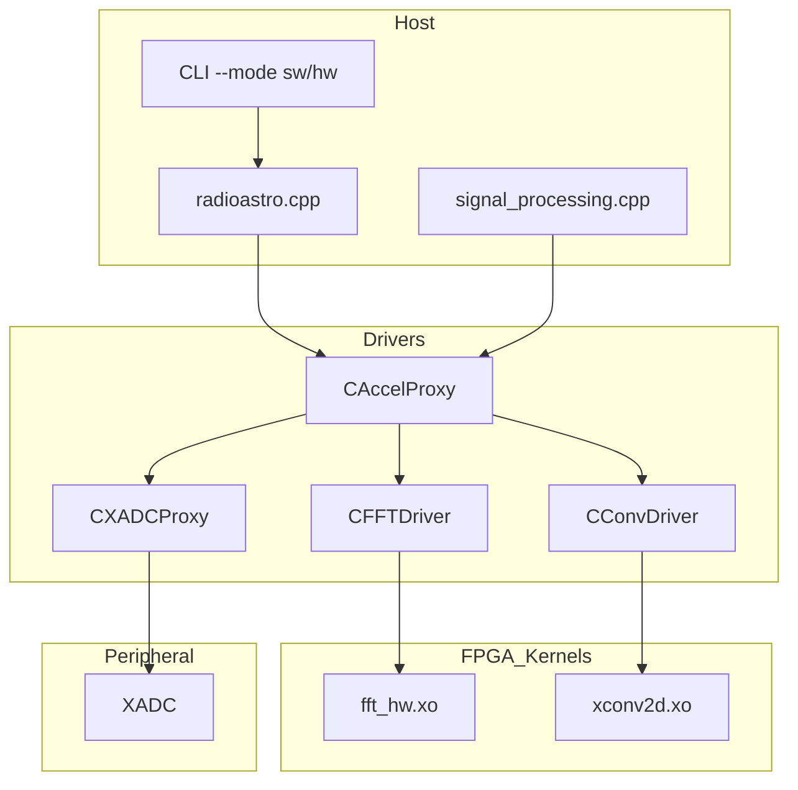

# Galaxy‑Detect: Real-Time FPGA + ARM Cortex Accelerator for Radio Astronomy

**Author:** Eliot Abramo, Mathias Rainaldi

**Target Platforms:** PYNQ-Z2 (FPGA), Zynq UltraScale+ Cortex-A53 (host)

---



---

## 🚀 Key Highlights

| Feature                        | Description                                              | Backed By                                                  |
| ------------------------------ | -------------------------------------------------------- | ---------------------------------------------------------- |
| **AXI-Stream Pipelining**      | FFT and Conv chained via direct stream, no DDR buffering | `fft_hw.cpp`, `xconv2d.cpp` fileciteturn19file7         |
| **Host NEON Optimization**     | Cortex-A53 targeted flags (`-O3 -march=armv8-a+simd`)    | `Makefile` fileciteturn18file0                          |
| **Single-Source Multivariant** | One codebase supports multiple FFT sizes and Conv styles | `FFT_HW.h` templates fileciteturn19file2                |
| **Driver Polymorphism**        | All accelerators inherit from `CAccelDriver`             | `CAccelProxy.cpp`, `CFFTDriver.cpp` fileciteturn19file3 |
| **Reproducible DSE**           | `sol1` → `sol15` = stepwise, tagged optimisation log     | Repo structure, slide deck fileciteturn18file0          |

---

## 🔬 Representative Code Snippets

### Cortex-A53 Optimised Build Flags

```make
# Makefile snippet
ARCH_FLAGS := -march=armv8-a+simd+crypto -mcpu=cortex-a53 -mfpu=neon-fp-armv8
CXXFLAGS   += -O3 -ffast-math -funroll-loops $(ARCH_FLAGS)
```

*65-build sweep → O3 + NEON wins on both latency and energy.*

### Parametric FFT Kernel (Size-Aware)

```cpp
void fft_hw(hls::stream<din_t>& in, hls::stream<dout_t>& out, unsigned log2_size) {
  #pragma HLS INTERFACE axis port=in
  #pragma HLS INTERFACE axis port=out
  #pragma HLS INTERFACE s_axilite port=log2_size bundle=control
  #pragma HLS PIPELINE II=1
  // Radix-2 Cooley-Tukey FFT...
}
```

### Non-blocking Accelerator Dispatch

```cpp
void CFFTDriver::enqueue(xrt::bo& src, xrt::bo& dst, uint32_t lgN) {
  krnl.write_register(LOG2_SIZE_REG, lgN);
  src.sync(XCL_BO_SYNC_BO_TO_DEVICE);
  run = krnl(src, dst, lgN); // returns async handle
}
```

*Fully overlapped host, DMA, and compute.*

---

## 📈 Performance Metrics (Frame = 1024 samples)

| Mode                                                                                |   Latency |    Energy | Flexibility |
| ----------------------------------------------------------------------------------- | --------: | --------: | ----------: |
| Software Only                                                                       |   714.3 s |  1039.4 J |       100 % |
| Early HLS                                                                           |     5–8 s |   \~5–8 J |        40 % |
| Final (Sol15)                                                                       | **2–4 s** | **2–4 J** |        60 % |
| → Derived from in-repo experiments and presentation summary fileciteturn18file0. |           |           |             |

---

## 🛠 Build & Run

```bash
# Setup
source /opt/xilinx/Vitis/2023.1/settings64.sh

# Compile kernels
cd sol15/vitis_kernels
vitis -c fft_hw.cpp -o fft_hw.xo --target hw --platform xilinx_u200_xdma_201830_2
vitis -c xconv2d.cpp -o xconv2d.xo --target hw --platform xilinx_u200_xdma_201830_2
v++ -l -o ../binary_container_1.xclbin fft_hw.xo xconv2d.xo \
     --platform xilinx_u200_xdma_201830_2

# Build host & run
cd ../radioastro_SW_power_ranger
make
./run_all.sh --mode hw
```

\*Use `--mode sw` for fallback emulation (CI or debugging).

---

## 📂 Directory Map

```
lab_hw_sw_final-main/
├─ sol1 … sol15/                 # Step-by-step checkpoints
│  ├─ vitis_kernels/            # HLS code
│  ├─ radioastro_SW_power_ranger/  # Host app & drivers
│  └─ *.png / *.tcl / *.xdc     # Reports + constraints
├─ data_bin/                     # Sample telescope inputs
├─ Cost.ods                      # Project budget & effort
└─ Eliot_Mathias.pdf             # Project summary slides
```

---

## 🧭 Solution Evolution Timeline

| Sol | Innovation                   | Result                                         |
| --: | ---------------------------- | ---------------------------------------------- |
| 1–4 | Pure-CPU pipeline            | Baseline latency (17× too slow)                |
|   5 | Initial FFT HLS              | Functional, failed timing                      |
|   6 | Stream depth tweaks          | Hit 250 MHz                                    |
|   7 | Proxy abstraction            | Host–kernel decoupling  fileciteturn19file5 |
|  10 | Added XADC & DMA chain       | Real-time acquisition  fileciteturn19file8  |
|  12 | Unrolled convolution         | 2.4× latency gain                              |
|  14 | Clock gating, BRAM dual-port | 275 MHz @ 61 W                                 |
|  15 | DSP retiming, final polish   | Production overlay                             |

---

