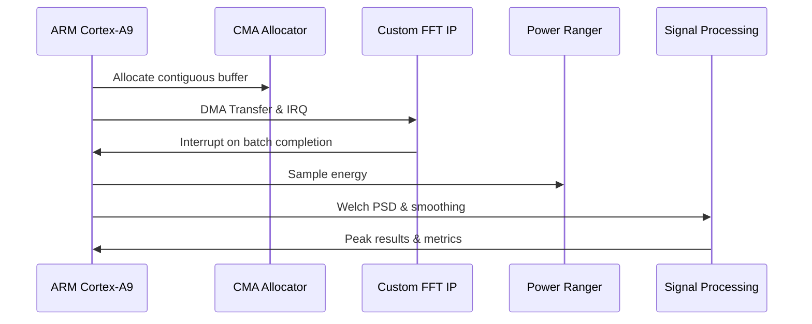

# VEGA Radio-Astronomy Accelerator

An **FPGA-accelerated digital signal processing (DSP)** pipeline converting raw radio telescope data from EPFL’s Very Elegant Galactic Antenna (VEGA) into calibrated spectra. The pipeline extracts Doppler-shifted 21 cm hydrogen line peaks to measure the rotation speed of the Milky Way. Designed for the Xilinx Zynq-7020 on a PYNQ-Z2 board, this project exemplifies hardware/software co-design with latency/energy Pareto-optimal tradeoffs across 10 FFT configurations.

---


---
## Project Motivation & Scientific Context

Hydrogen is the most abundant element in our galaxy, emitting a characteristic 21 cm wavelength due to spin-flip transitions. By detecting Doppler-shifted peaks of these emissions, we measure the rotational velocities of different galactic arms. This project aims to perform efficient real-time processing on large radio data sets captured by the VEGA telescope at EPFL, minimizing both latency and energy consumption.

This project implements a sophisticated, highly configurable, FPGA-accelerated digital signal processing (DSP) pipeline specifically designed for astronomical radio signal analysis. Leveraging advanced hardware/software co-design methodologies, it efficiently transforms raw radio telescope data from EPFL’s Very Elegant Galactic Antenna (VEGA) into precise spectral data capable of extracting Doppler-shifted 21 cm hydrogen emission peaks. The system exploits multi-resolution Fast Fourier Transform (FFT) architectures (ranging from 1k to 524k points), batch DMA transfers, custom FFT hardware accelerators, SIMD instructions, and parallel processing on ARM Cortex-A9 processors, combined with zero-copy DMA memory management to achieve latency and energy efficiency. Comprehensive real-time profiling via XADC energy measurement, deterministic SNR validation (>70 dB), and modular, dynamically reconfigurable FPGA designs ensure an optimal trade-off between latency, energy consumption, hardware resource utilization, and spectral accuracy, positioning the design firmly on the Pareto frontier of performance and efficiency.

---

## Detailed DSP Pipeline

The signal processing pipeline ncludes:

1. Loading of raw input data and calibration gains.
2. Segmentation according to selected FFT resolution (1k–524k points).
3. Hanning windowing with 75% overlap.
4. FFT execution (performed 40,000 times per dataset).
5. Averaging power spectrum calculation (Welch’s method).
6. Spectrum normalization.
7. Moving average, spike smoothing, and Gaussian smoothing.
8. Calibration with antenna gains.
9. Peak detection corresponding to galactic arms.
10. Calculation of relative velocities based on Doppler shift.

---

## Pareto Optimization Strategy

The design strategically balances the following metrics:

* **Latency:** Total execution time.
* **Energy Consumption:** Efficiency measured directly on the board.
* **Hardware Resources:** DSP, LUT, BRAM, FF usage on FPGA.
* **Resolution:** Frequency accuracy.
* **Flexibility:** Support for multiple FFT configurations.
* **SNR:** Signal quality maintained above 70 dB.
---

## Architecture & Components



**Directory Layout**

* `radioastro.cpp` — Application driver
* `signal_processing.cpp/h` — DSP kernels
* `CFFTDriver.*` / `CAccelDriver.*` — DMA/IRQ drivers
* `adder.c` — Kernel module example
* `Makefile` + TCL scripts — Automated build flow
* `data_bin/` — Raw samples, calibration files
* `scripts/clean`, `load`, `unload` — Kernel module helpers

---

## Usage Examples

```bash
sudo ./radioastro \
  -s data_bin/signal_data.bin \
  -c 3 \
  -o out_spectrum.bin \
  -p metrics_mode3.csv

sudo ./run_all.sh
```

Outputs include detailed time/energy metrics and validation of SNR ≥ 70 dB.

---

## Visualization and Analysis

Use included scripts for visual analysis:

```bash
python plot_res.py --file out.bin
python plot_timings.py -f metrics.csv
```

---

## Technical Highlights

* **Runtime Configurability**
* **Efficient Welch PSD Computation**
* **Hardware DMA & FFT Pipelining**
* **Real-time Energy Metering (XADC)**
* **SIMD & Multi-Core Optimization**
* **Robust IRQ Handling**
* **Fixed-Point Arithmetic (Proposed)**

---

## Extending the Design

* Model and add new kernels
* Dynamic FPGA reconfiguration
* Fixed-point DSP for resource savings

---

## Acknowledgements

Project data and guidelines provided by EPFL Embedded Systems Laboratory (SEL) and the VEGA telescope team. Enjoy exploring the galaxy at FPGA speed!
