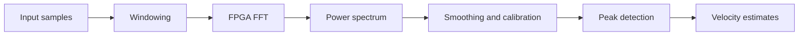
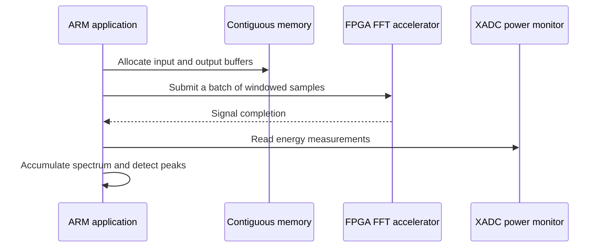

# Astrorapide

**An FPGA-accelerated radio-astronomy pipeline for turning telescope samples into hydrogen-line spectra and radial-velocity estimates.**

Astrorapide takes complex radio samples captured for EPFL's VEGA telescope project and carries them through the full signal-processing chain: windowing, Fourier analysis, power-spectrum estimation, smoothing, calibration, peak detection, and Doppler conversion around the neutral-hydrogen line at 1420.40575177 MHz.

Built for the Xilinx Zynq-7020 on a PYNQ-Z2, the project is an exercise in hardware/software co-design with a genuinely astronomical target. A custom HLS FFT accelerator handles the transform on the FPGA while the ARM processor orchestrates data movement and finishes the spectral analysis. Ten analysis configurations span FFT sizes from 1K to 512K samples, and a sequence of hardware designs explores the trade-offs between latency, energy, FPGA resources, flexibility, and signal fidelity.

The final submission uses a deeply pipelined, fixed-size 4096-point FFT accelerator and processes transforms in batches through contiguous shared buffers. Alongside the source, this repository preserves the working PYNQ overlay, the design iterations that led to it, and the original measurements used to compare them.

## Why the hydrogen line?

Neutral hydrogen emits at a characteristic wavelength of roughly 21 cm. Motion along the observer's line of sight shifts that emission away from its rest frequency; measuring the shift reveals radial velocity through the Doppler relation. Across different directions in the sky, those velocities can be used to study the structure and rotation of the Milky Way.

Astrorapide implements the computational path from recorded samples to candidate peak frequencies and velocity estimates. The scientific interpretation still depends on the quality and calibration of the telescope data—it is not claimed here as an independently validated galactic measurement.

## Signal processing pipeline


```mermaid
flowchart LR
    A[Input samples] --> B[Windowing]
    B --> C[FPGA FFT]
    C --> D[Power spectrum]
    D --> E[Smoothing and calibration]
    E --> F[Peak detection]
    F --> G[Velocity estimates]
```

The final application performs the following main stages:

1. Load the input samples, configuration, and reference data.
2. Apply a Hann window to each segment.
3. Transfer batches to a custom 4096-point FFT accelerator.
4. Accumulate and normalize the power spectral density.
5. Apply moving-average, peak, and Gaussian smoothing.
6. Apply the supplied antenna calibration gains.
7. Detect spectral peaks and estimate their Doppler velocities.
8. Record timing, board-energy, resolution, and SNR measurements.

The SNR value is a comparison against the supplied reference output. The application warns when it falls below its configured threshold; this is a validation mechanism for the project dataset, not a general performance guarantee.

## Architecture


```mermaid
sequenceDiagram
    participant App as ARM application
    participant CMA as Contiguous memory
    participant FFT as FPGA FFT accelerator
    participant XADC as XADC power monitor
    App->>CMA: Allocate input and output buffers
    App->>FFT: Submit a batch of windowed samples
    FFT-->>App: Signal completion
    App->>XADC: Read energy measurements
    App->>App: Accumulate spectrum and detect peaks
```

The final design includes:

- an HLS implementation of a fixed-size, 4096-point FFT;
- a memory-mapped accelerator driver and contiguous-memory buffers;
- ARM-side spectrum processing, calibration, and peak detection;
- XADC-based energy measurement support;
- a generated PYNQ bitstream and hardware handoff file; and
- scripts for loading the overlay, running the application, and plotting profiling results.

## Design exploration

This was not a single accelerator written once. The repository records a progression from an optimized software baseline to several FPGA FFT architectures, including staged and pipelined variants. Each solution was evaluated using the same broader set of concerns:

- **latency** — time spent in the complete DSP pipeline and its individual stages;
- **energy** — measurements collected through the board's XADC setup;
- **signal fidelity** — SNR against supplied reference spectra;
- **resolution** — the frequency and derived velocity resolution of each configuration;
- **resources** — the FPGA cost of the synthesized accelerator; and
- **flexibility** — how many of the ten analysis configurations a hardware design can serve.

The original report identifies Pareto-front solutions within that project-specific design space. Those results are meaningful comparisons for the recorded board, dataset, and tool flow, rather than universal performance claims.

Earlier solutions explore different FFT sizes and hardware/software partitions. Their source files are retained under `experiments/`, while duplicated bitstreams, datasets, screenshots, and generated metrics have been removed. The original comparison and measurements are available in the [project report](docs/project-report.pdf).

## Repository layout

```text
.
├── final/              Final HLS, Vivado, host software, and overlay artifacts
├── experiments/        Source-only archive of solutions 1 through 14
├── starter-files/      Original project starter sources
└── docs/               Project report and solution-cost spreadsheet
```

The main parts of `final/` are:

- `HLS/` — FFT accelerator source and testbench
- `radioastro_SW_power_ranger/` — ARM-side application and profiling support
- `Vivado.tcl` — Vivado project-generation script
- `programOverlay.py` — small PYNQ overlay loader
- `sol15.bit` and `sol15.hwh` — generated final overlay
- `data_bin/data.txz` — packaged project dataset

## Requirements

Reproducing the complete system requires approximately the original environment:

- PYNQ-Z2 with a Xilinx Zynq-7020;
- a compatible Vivado and Vitis HLS installation;
- PYNQ and the required CMA userspace library;
- XADC/Power Ranger support for energy measurements;
- root access for hardware mapping and profiling; and
- the dataset included in `final/data_bin/data.txz`.

Exact tool versions were not recorded. The generated overlay is included because rebuilding an older FPGA design with a newer toolchain may require adjustments. The project has not been tested on other FPGA boards.

## Build and run

The host Makefile targets ARMv7, enables NEON and OpenMP flags, and links against `libcma`. It is therefore intended to be built in the configured PYNQ-Z2 environment rather than on a normal desktop machine.

Extract the data and compile the application on the board:

```bash
cd final/data_bin
tar -xf data.txz

cd ../radioastro_SW_power_ranger
make
```

Load the final overlay:

```bash
cd final
sudo ./programOverlay.py sol15.bit
```

Then run the retained experiment script:

```bash
cd radioastro_SW_power_ranger
sudo ./run_all.sh
```

The script runs the equivalent of:

```bash
sudo ./radioastro \
  -c 2 \
  -s ../data_bin/signal_data.bin \
  -o out_2.bin \
  -p metrics.csv
```

It removes previous `metrics.csv` and `out_*.bin` files before starting. These generated files are ignored by Git.

## Results and limitations

The project reached a complete FPGA-assisted path from input samples to calibrated spectra, detected peaks, velocity estimates, and per-stage timing and energy profiles. Its strongest result is the breadth of that co-design exploration: multiple accelerators were built and compared across all ten analysis configurations, with the final implementation demonstrating batched hardware FFT execution integrated into the complete application.

The recorded numbers belong to the original board, dataset, and tool environment. See the [project report](docs/project-report.pdf) for those measurements rather than treating them as portable benchmarks.

Important limitations include:

- the final hardware accelerator is fixed to a 4096-point FFT;
- execution depends on PYNQ-specific memory mapping and FPGA support;
- energy results depend on the board's XADC measurement setup;
- the dataset and reference files are specific to the original project; and
- peak detection and velocity estimates have not been validated as a calibrated scientific workflow.

## Credits

Astrorapide was created by Eliot Abramo and Mathias Rainaldi in 2025 for EPFL's EE-390(a) digital systems design course. Project data and infrastructure were provided in connection with the EPFL Embedded Systems Laboratory and the VEGA radio telescope project.
